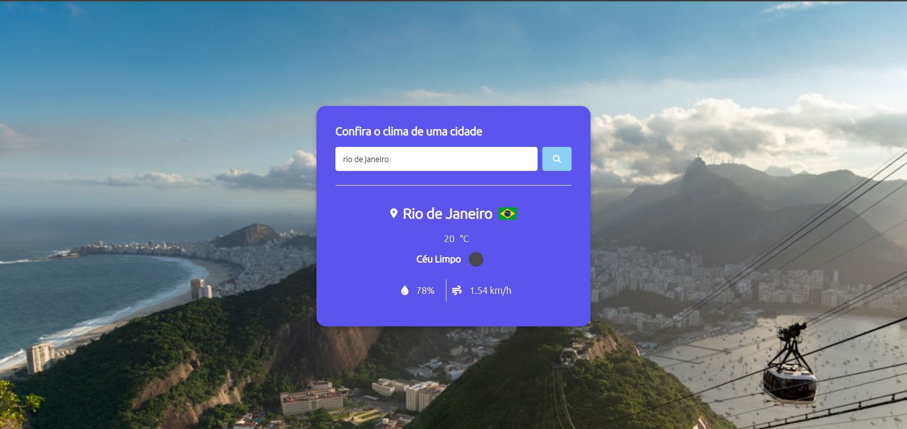
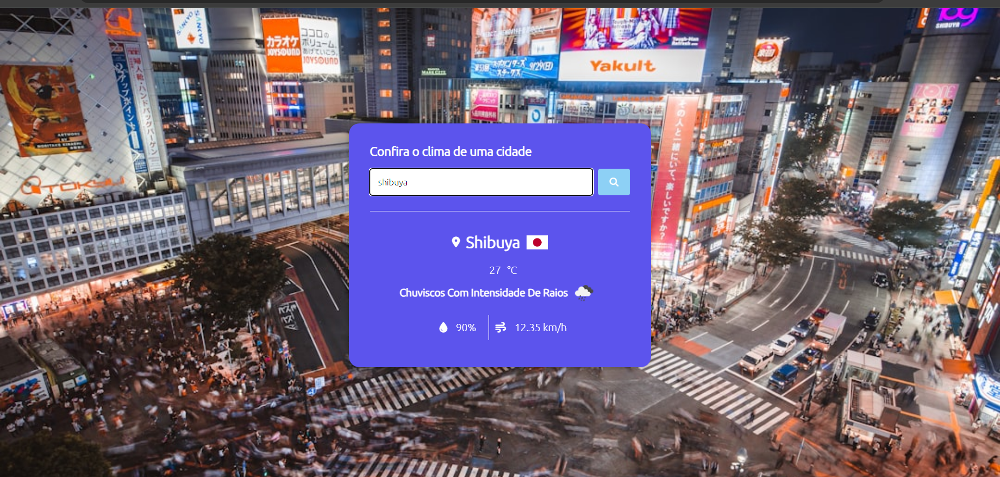
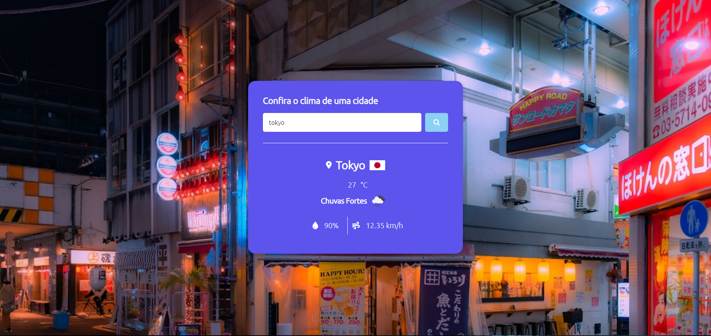
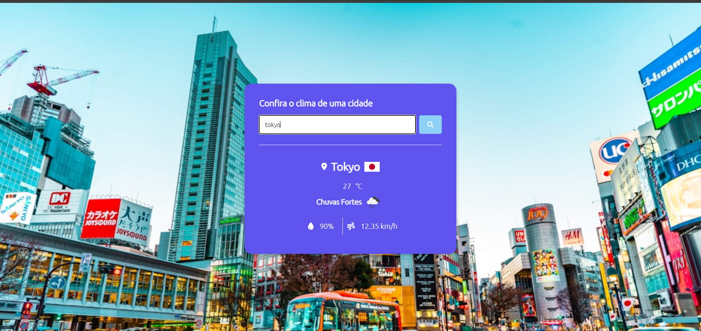
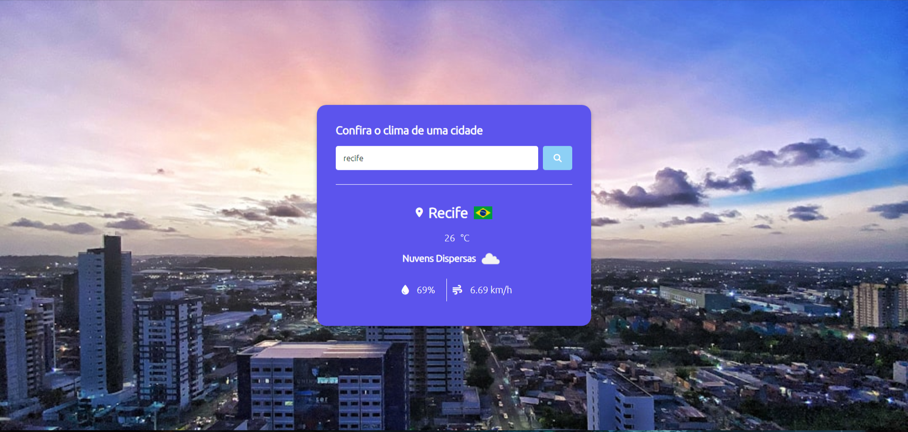

# Site Climático

[](https://github.com/seu-usuario/seu-repositorio/blob/main/LICENSE)

## Sobre o Projeto

O Site Climático é um dos primeiros projetos desenvolvidos por Cauã Sebastian.Dev no início de sua carreira como desenvolvedor. Este projeto tem como objetivo fornecer informações meteorológicas em tempo real de diversas cidades ao redor do mundo. Utilizando HTML, CSS e JavaScript, juntamente com as APIs do OpenWeatherMap e do Unsplash, este site permite aos usuários visualizarem a temperatura, descrição do clima, umidade, velocidade do vento e uma imagem representativa da cidade pesquisada.

## Funcionalidades

- **Buscar Clima**: Os usuários podem digitar o nome da cidade desejada na caixa de pesquisa e pressionar Enter ou clicar no botão de pesquisa para ver os detalhes meteorológicos.
- **Visualização**: Além dos dados meteorológicos, uma imagem da cidade é exibida para contextualizar melhor a condição climática.

## Tecnologias Utilizadas

- HTML
- CSS
- JavaScript
- OpenWeatherMap API
- Unsplash API

## Autor

Olá! Meu nome é Cauã Sebastian e este projeto foi uma das minhas primeiras incursões no mundo da programação. Durante o início da minha jornada como desenvolvedor, fui inspirado a criar este site climático para compartilhar minha paixão pela tecnologia e pela meteorologia.

Desenvolver este projeto foi uma experiência incrível, onde pude aplicar meus conhecimentos em HTML, CSS e JavaScript, além de aprender a integrar APIs como o OpenWeatherMap e o Unsplash. A ideia por trás do site era proporcionar uma forma simples e intuitiva para as pessoas verificarem o clima de qualquer cidade em tempo real.

Embora tenha sido um desafio no começo, cada obstáculo superado me proporcionou um crescimento significativo como desenvolvedor. Estou constantemente buscando aprender e evoluir, e este projeto foi um marco importante nessa jornada.

Se você gostou do meu trabalho ou tem alguma ideia para compartilhar, ficarei feliz em ouvir! Você pode me encontrar no LinkedIn [aqui](www.linkedin.com/in/cauã-sebastian-57a532259).

## Imagens












## Como Executar o Projeto

### Pré-requisitos

- Navegador da Web

### Executando o Projeto

1. Clone o repositório:
   ```bash
   git clone https://github.com/seu-usuario/seu-repositorio
